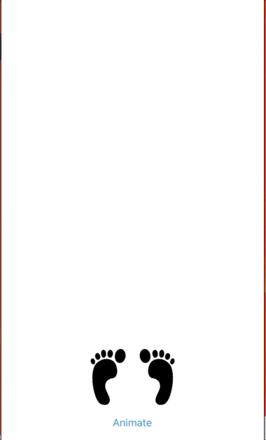

AnimationGroups

This project demonstrates using CABasicAnimation and CAAnimationGroup objects to animate multiple CALayers at the same time.

It is based on sample code posted on Stack Overflow by Matt Neuburg in the thread at https://stackoverflow.com/a/63710424/205185

The trick to making multi-layer animations using CAAnimationGroup objects work is to install the animation group on the parent layer, and have the sub animations use a path that starts with `subLayers`. For example, if a view controller's main view's layer has a sublayer called `left`, you would use the path `sublayers.left.position.y` to animate the left layer's vertical postition.

Here is an illustration of animations on 2 separate layers, a left foot and a right foot:

